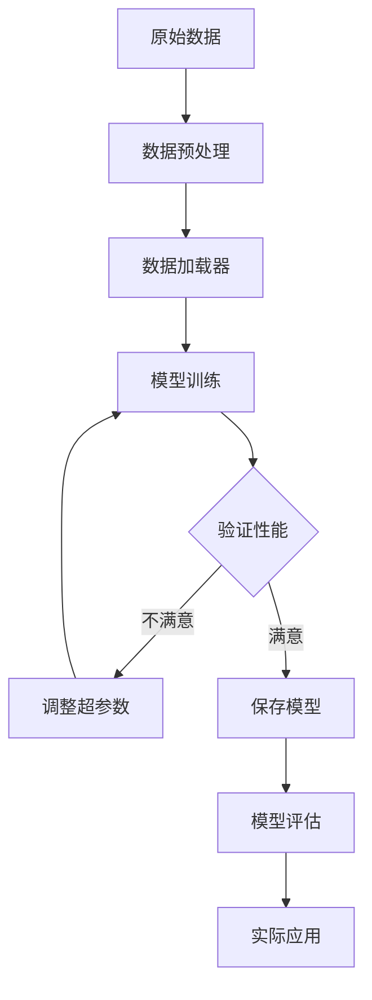

# 图像分类项目使用逻辑详解

## 一、项目整体逻辑流程

### 1.1 项目设计理念

本项目采用**模块化设计思想**，将图像分类任务分解为几个独立但相互协作的模块：

```
数据模块 → 模型模块 → 训练模块 → 评估模块 → 推理模块
   ↓          ↓          ↓          ↓          ↓
 加载数据    构建网络    优化参数    验证性能    实际应用
```

### 1.2 核心工作流程



## 二、各模块详细逻辑说明

### 2.1 数据模块逻辑 (src/data/)

#### 工作原理：

1. **数据组织**
   ```
   data/
   ├── train/        # 训练数据 (70%)
   │   ├── 类别1/    # 每个类别一个文件夹
   │   │   ├── 图片1.jpg
   │   │   └── 图片2.jpg
   │   └── 类别2/
   │       └── ...
   ├── val/          # 验证数据 (15%)
   └── test/         # 测试数据 (15%)
   ```

2. **DataLoader工作流程**
   ```
   读取图片 → 调整大小 → 数据增强 → 归一化 → 打包成批次
   ```

3. **数据增强策略**
   - 目的：增加数据多样性，提高模型泛化能力
   - 方法：随机翻转、旋转、缩放、亮度调整等
   - 时机：仅在训练时应用，验证和测试时不使用

#### 使用示例：

```python
# 步骤1：初始化数据加载器
from src.data import ImageDataLoader

loader = ImageDataLoader(
    data_dir='./data',
    batch_size=32,      # 每批处理32张图片
    img_size=(224, 224) # 统一调整为224x224大小
)

# 步骤2：获取数据
train_loader, val_loader, test_loader = loader.load_data()

# 步骤3：查看一个批次的数据
for images, labels in train_loader:
    print(f"图片批次形状: {images.shape}")  # [32, 3, 224, 224]
    print(f"标签批次形状: {labels.shape}")  # [32]
    break
```

### 2.2 模型模块逻辑 (src/models/)

#### 模型架构层次：

```
BaseModel (基类)
    ↓
    ├── SimpleCNN (简单CNN)
    ├── ResNetModel (残差网络)
    └── VGGModel (VGG网络)
```

#### 模型选择逻辑：

1. **SimpleCNN**
   - 适用场景：简单任务、小数据集、学习演示
   - 结构：Conv → ReLU → Pool → FC
   - 参数量：少（训练快）

2. **ResNet**
   - 适用场景：中等到复杂任务、中大型数据集
   - 结构：残差连接（解决梯度消失）
   - 版本：ResNet18（较轻）→ ResNet50（较重）

3. **VGG**
   - 适用场景：需要深层特征提取
   - 结构：多层小卷积核堆叠
   - 特点：参数多、效果好

#### 迁移学习逻辑：

```
预训练模型（ImageNet权重）
    ↓
冻结前面层（特征提取器）
    ↓
只训练最后的分类层
    ↓
（可选）解冻部分层进行微调
```

**为什么使用迁移学习？**
- 预训练模型已学会提取通用特征（边缘、纹理、形状）
- 只需学习特定任务的分类决策
- 节省训练时间，提高性能

### 2.3 训练模块逻辑 (src/train.py)

#### 训练循环详解：

```python
for epoch in range(num_epochs):  # 遍历所有训练轮次
    
    # === 训练阶段 ===
    model.train()  # 设置为训练模式（启用dropout等）
    for batch_images, batch_labels in train_loader:
        
        # 1. 前向传播：计算预测
        predictions = model(batch_images)
        
        # 2. 计算损失：预测与真实标签的差距
        loss = criterion(predictions, batch_labels)
        
        # 3. 反向传播：计算梯度
        optimizer.zero_grad()  # 清零之前的梯度
        loss.backward()        # 计算新梯度
        
        # 4. 参数更新：根据梯度调整权重
        optimizer.step()
    
    # === 验证阶段 ===
    model.eval()  # 设置为评估模式（禁用dropout等）
    with torch.no_grad():  # 不计算梯度，节省内存
        for batch_images, batch_labels in val_loader:
            predictions = model(batch_images)
            val_loss = criterion(predictions, batch_labels)
            # 计算准确率等指标
    
    # === 检查点保存 ===
    if val_loss < best_loss:
        save_model(model, 'best_model.pth')
        best_loss = val_loss
```

#### 关键概念：

1. **Epoch（训练轮次）**
   - 一个epoch = 遍历完整个训练集一次
   - 通常需要几十到几百个epoch

2. **Batch（批次）**
   - 一次处理多张图片（如32张）
   - 优点：加速训练、稳定梯度

3. **学习率（Learning Rate）**
   - 控制参数更新的步长
   - 太大：不收敛；太小：训练慢

4. **损失函数（Loss Function）**
   - 衡量预测与真实值的差距
   - 分类任务常用：交叉熵损失

### 2.4 评估模块逻辑 (src/evaluate.py)

#### 评估指标含义：

1. **准确率 (Accuracy)**
   ```
   Accuracy = 预测正确的样本数 / 总样本数
   ```
   - 最直观的指标
   - 类别不平衡时可能误导

2. **精确率 (Precision)**
   ```
   Precision = 真阳性 / (真阳性 + 假阳性)
   ```
   - "预测为正的样本中，真正为正的比例"
   - 关注"不误报"

3. **召回率 (Recall)**
   ```
   Recall = 真阳性 / (真阳性 + 假阴性)
   ```
   - "真正为正的样本中，被找出的比例"
   - 关注"不漏报"

4. **F1分数**
   ```
   F1 = 2 × (Precision × Recall) / (Precision + Recall)
   ```
   - 精确率和召回率的调和平均
   - 综合评价指标

5. **混淆矩阵 (Confusion Matrix)**
   ```
                预测
              猫    狗
   真  猫    90    10     → 90%准确率
   实  狗     5    95     → 95%准确率
   ```
   - 直观展示各类别的分类情况
   - 发现模型的偏向性

### 2.5 推理模块逻辑 (src/predict.py)

#### 推理流程：

```
输入图片
    ↓
预处理（与训练时相同）
    ↓
模型前向传播
    ↓
输出概率分布 [0.1, 0.05, 0.8, 0.05]
    ↓
选择最大概率的类别
    ↓
返回预测结果
```

## 三、完整使用示例

### 示例场景：训练一个猫狗分类器

#### 步骤1：准备数据

```bash
# 数据结构
data/
├── train/
│   ├── cat/          # 1000张猫的图片
│   └── dog/          # 1000张狗的图片
├── val/
│   ├── cat/          # 150张
│   └── dog/          # 150张
└── test/
    ├── cat/          # 150张
    └── dog/          # 150张
```

#### 步骤2：配置训练参数

```yaml
# configs/config.yaml
model:
  name: 'resnet18'       # 选择ResNet18（较轻量）
  num_classes: 2         # 2个类别（猫、狗）
  pretrained: true       # 使用预训练权重

training:
  batch_size: 32         # 每批32张图片
  num_epochs: 50         # 训练50轮
  learning_rate: 0.001   # 学习率

data:
  img_size: [224, 224]   # 图片大小
  augmentation:
    horizontal_flip: true  # 水平翻转增强
    rotation: 15           # 旋转±15度
```

#### 步骤3：开始训练

```bash
python scripts/train.py --config configs/config.yaml
```

**训练过程输出示例：**
```
Epoch 1/50
Train Loss: 0.693, Train Acc: 0.520
Val Loss: 0.580, Val Acc: 0.680
Saved best model!

Epoch 2/50
Train Loss: 0.520, Train Acc: 0.750
Val Loss: 0.420, Val Acc: 0.820
Saved best model!

...

Epoch 50/50
Train Loss: 0.050, Train Acc: 0.980
Val Loss: 0.120, Val Acc: 0.960
Training completed!
```

#### 步骤4：评估模型

```bash
python scripts/evaluate.py --model_path models/saved_models/best_model.pth
```

**评估结果示例：**
```
=== Evaluation Results ===
Accuracy: 96.0%
Precision: 95.8%
Recall: 96.2%
F1-Score: 96.0%

Confusion Matrix:
          Predicted
          Cat    Dog
Actual Cat  143     7
      Dog    5    145

Per-class Accuracy:
Cat: 95.3%
Dog: 96.7%
```

#### 步骤5：预测新图片

```bash
python scripts/predict.py --image_path my_pet.jpg --model_path models/saved_models/best_model.pth
```

**预测结果示例：**
```
Image: my_pet.jpg
Prediction: Dog
Confidence: 98.5%

Class Probabilities:
Cat: 1.5%
Dog: 98.5%
```

## 四、配置参数调优指南

### 4.1 学习率调整

**现象1：损失不下降**
```yaml
# 可能学习率太小
learning_rate: 0.01  # 尝试增大
```

**现象2：损失震荡**
```yaml
# 可能学习率太大
learning_rate: 0.0001  # 尝试减小
```

### 4.2 批次大小调整

**显存不足**
```yaml
batch_size: 16  # 减小批次大小
```

**训练太慢**
```yaml
batch_size: 64  # 增大批次大小（需要足够显存）
```

### 4.3 模型选择

**数据量小（<1000张）**
```yaml
model:
  name: 'simple_cnn'
  pretrained: false
```

**数据量中等（1000-10000张）**
```yaml
model:
  name: 'resnet18'
  pretrained: true
```

**数据量大（>10000张）**
```yaml
model:
  name: 'resnet50'
  pretrained: true
```

### 4.4 防止过拟合

**增加数据增强**
```yaml
augmentation:
  horizontal_flip: true
  vertical_flip: true
  rotation: 30
  zoom_range: 0.3
  brightness_range: [0.7, 1.3]
```

**增加Dropout**
```yaml
model:
  dropout: 0.5  # 0到1之间，越大正则化越强
```

**早停策略**
```yaml
early_stopping:
  patience: 10  # 验证损失10个epoch不下降就停止
```

## 五、常见问题诊断

### 5.1 训练问题

| 问题 | 可能原因 | 解决方案 |
|-----|---------|---------|
| 训练损失不下降 | 学习率太小 | 增大学习率 |
| 训练损失震荡 | 学习率太大 | 减小学习率 |
| 训练很慢 | 批次太小/没用GPU | 增大batch_size，使用GPU |
| 显存溢出 | 批次太大/模型太大 | 减小batch_size或图片大小 |

### 5.2 性能问题

| 问题 | 表现 | 解决方案 |
|-----|-----|---------|
| 过拟合 | 训练准确率高，验证准确率低 | 数据增强、Dropout、早停 |
| 欠拟合 | 训练和验证准确率都低 | 增加模型复杂度、训练更多轮 |
| 类别不平衡 | 某些类别准确率很低 | 类别权重、重采样 |

### 5.3 数据问题

**标签错误检测**
```python
# 查看模型严重预测错误的样本
# 这些样本可能标签有误
```

**数据质量检查**
```python
# 检查图片是否损坏
# 检查图片分辨率是否一致
# 检查类别分布是否平衡
```

## 六、高级使用技巧

### 6.1 学习率调度

```yaml
scheduler:
  type: 'step'       # 阶梯式下降
  step_size: 30      # 每30个epoch
  gamma: 0.1         # 学习率变为原来的0.1倍

# 或使用余弦退火
scheduler:
  type: 'cosine'
  T_max: 100
```

### 6.2 混合精度训练

```yaml
hardware:
  mixed_precision: true  # 加速训练，减少显存使用
```

### 6.3 多GPU训练

```python
# 在train.py中
if torch.cuda.device_count() > 1:
    model = torch.nn.DataParallel(model)
```

### 6.4 模型集成

```python
# 训练多个模型
models = [
    train_model(config1),
    train_model(config2),
    train_model(config3)
]

# 预测时取平均
predictions = sum([m.predict(img) for m in models]) / len(models)
```

## 七、工作流程总结

### 标准工作流程

```
1. 数据准备（最重要！）
   ↓
2. 小规模实验（验证代码正确性）
   ↓
3. 基线模型（简单模型作为参照）
   ↓
4. 逐步改进（调整参数、更换模型）
   ↓
5. 最终评估（测试集评估）
   ↓
6. 模型部署（实际应用）
```

### 实验记录建议

每次实验记录：
- 模型架构
- 超参数配置
- 训练时间
- 最终性能
- 特殊观察

这样可以追踪什么有效，什么无效。

## 八、项目优势

1. **模块化设计**：各模块独立，易于修改和扩展
2. **配置化管理**：超参数统一管理，便于实验
3. **完整流程**：从数据到部署的完整覆盖
4. **易于学习**：清晰的代码结构，适合初学者

## 九、下一步学习

1. 理解每个模块的作用
2. 在小数据集上实践
3. 尝试不同配置
4. 阅读代码实现
5. 自己实现核心功能

---

**使用建议**：
- 先运行完整流程，理解整体逻辑
- 然后深入每个模块，理解实现细节
- 最后根据需求定制和扩展

如有问题，查看代码注释或提Issue讨论！
